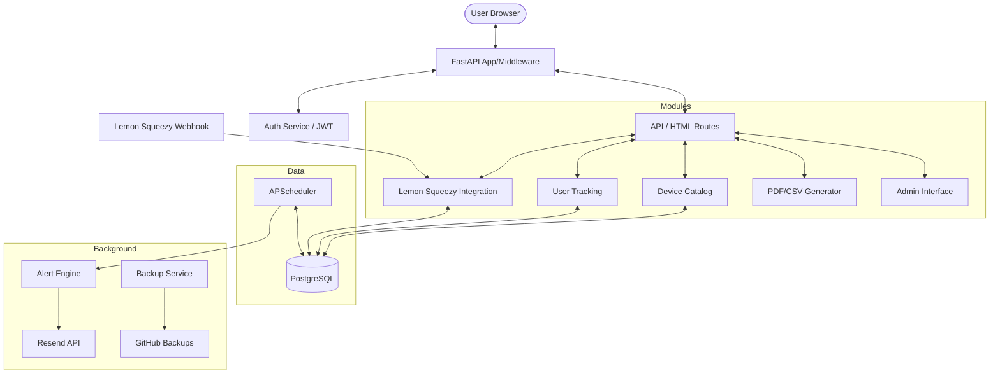

# EOS Tracker: Comprehensive Project Documentation
Version: 1.1.0
Date: 2026-02-01

---

## 1. Project Vision & Core Concept

### 1.1 The Problem
Enterprise network infrastructure (Cisco routers, Juniper switches, Palo Alto firewalls) follows a strict lifecycle. Manufacturers release hardware, then announce **End of Sale (EoS)**, followed by **End of Support (EoS)** or **End of Life (EoL)**. Missing these dates leads to:
- **Security Risks**: No more security patches for critical vulnerabilities.
- **Operational Risks**: Hardware failure without manufacturer support means downtime.
- **Compliance Issues**: Regulated industries (PCI-DSS, HIPAA) require supported hardware.

### 1.2 The Solution: EOS Tracker
EOS Tracker is a centralized, automated platform designed for network engineers and IT managers. It eliminates the need for manual spreadsheets by providing:
- A curated catalog of networking devices with accurate lifecycle dates.
- An automated alerting system (Email-based) that notifies users at specific milestones.
- Multi-format reporting (PDF, CSV, Excel) for inventory management.
- A tiered subscription model (Free/Pro) to scale with business needs.

---

## 2. Technical Architecture

### 2.1 Technology Stack
- **Backend Framework**: [FastAPI](https://fastapi.tiangolo.com/) (Asynchronous, Type-hinted)
- **Database**: [PostgreSQL](https://www.postgresql.org/) (Relational storage)
- **ORM**: [SQLAlchemy 2.0](https://www.sqlalchemy.org/)
- **Frontend**: HTML5, Vanilla CSS (Terminal-inspired design), [Jinja2 Templates](https://jinja.palletsprojects.com/)
- **Task Scheduling**: [APScheduler](https://apscheduler.readthedocs.io/) (PostgreSQL-backed job store)
- **Authentication**: JWT (JSON Web Tokens) with dual Cookie/Header support
- **Infrastructure**: [Docker](https://www.docker.com/) & [Docker Compose](https://docs.docker.com/compose/)
- **External Integrations**:
  - **Lemon Squeezy**: Payments & Subscription management
  - **Resend**: Transactional & Alert emails
  - **GitHub API**: Automated offsite database backups

### 2.2 System Architecture Diagram


---

## 3. Detailed Module Analysis (9 Components)

### 3.1 Module 1: `admin` (Administration Interface)
Provides a secure backend for managing system data without direct database access.
- **Purpose**: Internal management of users, devices, and financial records.
- **Key Files**:
    - [views.py](file:///c:/Users/HP/Downloads/eostracker/admin/views.py): Defines `ModelView` classes for SQLAdmin. Includes custom formatters for dates and logic to hash passwords when editing users.
    - [auth.py](file:///c:/Users/HP/Downloads/eostracker/admin/auth.py): Implements `AdminAuth` backend. Verifies admin flags and manages session-based login for the admin panel.
- **Security**: Uses a separate session-based cookie mechanism from the main app, requiring explicit `is_admin` status.

### 3.2 Module 2: `alerts` (Notification Engine)
The core "active" part of the system that monitors dates and sends emails.
- **Push vs. Scheduled**: Combines daily global checks with "debounced" immediate checks when new devices are added.
- **Key Files**:
    - [service.py](file:///c:/Users/HP/Downloads/eostracker/alerts/service.py): The business logic. Calculates days until EOS and matches them against thresholds (365, 180, 90, 30 days).
    - [scheduler.py](file:///c:/Users/HP/Downloads/eostracker/alerts/scheduler.py): Configures APScheduler with a PostgreSQL job store to ensure tasks survive restarts.
    - [email.py](file:///c:/Users/HP/Downloads/eostracker/alerts/email.py): Integration with the **Resend API**. Handles HTML template rendering for alerts and welcome emails.
    - [integration.py](file:///c:/Users/HP/Downloads/eostracker/alerts/integration.py): Provides a bridge for other services to trigger alert checks (e.g., after a CSV import).

### 3.3 Module 3: `auth` (Identity & Security)
Manages user sessions, credentials, and access control.
- **Role**: Stateless authentication using JWTs.
- **Key Files**:
    - [security.py](file:///c:/Users/HP/Downloads/eostracker/auth/security.py): Core crypto logic using `bcrypt` (rounds=12) and `PyJWT`. Handles token creation and expiration.
    - [dependencies.py](file:///c:/Users/HP/Downloads/eostracker/auth/dependencies.py): FastAPI dependencies. `get_current_user` extracts JWTs from BOTH headers and cookies, enabling seamless API and Browser usage. Includes `require_pro_tier` decorator.

### 3.4 Module 4: `database` (Data Layer)
The foundation of the platform, managing persistence and integrity.
- **Structure**: Uses SQLAlchemy Declarative system with Type-Annotated models.
- **Key Files**:
    - [models.py](file:///c:/Users/HP/Downloads/eostracker/database/models.py): Defines the 5 core tables (`User`, `Device`, `TrackedDevice`, `Subscription`, `AlertHistory`).
    - [connection.py](file:///c:/Users/HP/Downloads/eostracker/database/connection.py): Manages the connection pool (`QueuePool`) and the `get_db` dependency.
    - [validators.py](file:///c:/Users/HP/Downloads/eostracker/database/validators.py): Ensures device data uploaded via CLI or CSV meets strict date and format requirements.
    - [device_cli.py](file:///c:/Users/HP/Downloads/eostracker/database/device_cli.py): A maintenance tool for bulk updating the catalog from JSON files.

### 3.5 Module 5: `devices` (Catalog Service)
Handles the "Searchable Universe" of networking equipment.
- **Role**: Optimized retrieval and filtering of the 100+ device catalog.
- **Key Files**:
    - [service.py](file:///c:/Users/HP/Downloads/eostracker/devices/service.py): Implements case-insensitive search (`ilike`) across multiple vendors and models. Handles pagination logic.
    - [utils.py](file:///c:/Users/HP/Downloads/eostracker/devices/utils.py): Pure helper functions for generating SEO slugs (e.g., "cisco-catalyst-3850") and calculating statuses.

### 3.6 Module 6: `reports` (Reporting & Export)
Generates business-ready documentation for users.
- **Role**: Transforms raw tracking data into professional formats.
- **Key Files**:
    - [service.py](file:///c:/Users/HP/Downloads/eostracker/reports/service.py): Orchestrates PDF generation and CSV exports.
    - [templates.py](file:///c:/Users/HP/Downloads/eostracker/reports/templates.py): Detailed **ReportLab** templates. Handles branding, table layouts, and conditional logic (Pro users get pie charts and bar graphs).

### 3.7 Module 7: `subscription` (Monetization)
Integrates with **Lemon Squeezy** for global payments.
- **Role**: Manages the user's financial lifecycle.
- **Key Files**:
    - [lemonsqueezy.py](file:///c:/Users/HP/Downloads/eostracker/subscription/lemonsqueezy.py): REST client for the Lemon Squeezy API.
    - [service.py](file:///c:/Users/HP/Downloads/eostracker/subscription/service.py): Business logic for creating checkouts and mapping external LS IDs to local `User` records.
    - [webhooks.py](file:///c:/Users/HP/Downloads/eostracker/subscription/webhooks.py): Secure listener for LS events. Uses HMAC signature validation to process renewals, cancellations, and payment failures.

### 3.8 Module 8: `tracking` (User Inventory)
Manages the specific devices a user has chosen to monitor.
- **Role**: Pivot point between users and the master device catalog.
- **Key Files**:
    - [service.py](file:///c:/Users/HP/Downloads/eostracker/tracking/service.py): Enforces tier limits (max 3 for Free). Manages the `TrackedDevice` join table.
    - [csv_handler.py](file:///c:/Users/HP/Downloads/eostracker/tracking/csv_handler.py): Handles bulk upload/download of tracked devices in CSV and Excel formats (a major Pro-tier selling point).

### 3.9 Module 9: `web` (Web Interface & Config)
The user-facing layer and application entry point.
- **Role**: Coordinates all modules and provides the UI.
- **Key Files**:
    - [config.py](file:///c:/Users/HP/Downloads/eostracker/web/config.py): Centralized Pydantic settings. Validates all `.env` variables on startup.
    - [startup.py](file:///c:/Users/HP/Downloads/eostracker/web/startup.py): Event handlers that start/stop the alert scheduler when the web server cycles.
    - [routes/](file:///c:/Users/HP/Downloads/eostracker/web/routes/): Contains the individual route modules (`public.py`, `dashboard.py`, `api.py`).
    - [static/](file:///c:/Users/HP/Downloads/eostracker/web/static/): CSS and JS assets (Terminal theme, responsive tables).

---

## 4. Infrastructure & Operations

### 4.1 Global Configuration ([web/config.py](file:///c:/Users/HP/Downloads/eostracker/web/config.py))
The application uses **Pydantic Settings** for robust, type-safe configuration.
- **Environment Validation**: Automatically validates that required keys (like `JWT_SECRET` or `DATABASE_URL`) are present.
- **Field Validators**: Custom logic to parse comma-separated strings (like `CORS_ORIGINS`) into Python lists.
- **Environment Switching**: Intelligent helpers (`is_production()`, `is_development()`) to toggle security headers and logging formats.

### 4.2 Application Lifecycle ([main.py](file:///c:/Users/HP/Downloads/eostracker/main.py))
The entry point orchestrates the entire system:
- **Middleware Chain**:
    1.  `SessionMiddleware`: Managing user state.
    2.  `CORSMiddleware`: Handling cross-origin requests.
    3.  `Security Headers`: Setting `X-Frame-Options`, `X-Content-Type-Options` for browser safety.
    4.  `Logging Middleware`: Capturing performance metrics for every request.
- **Static Assets**: Mounted at `/static` for serving CSS and JS.
- **Startup/Shutdown**: Calls `web/startup.py` to initialize the `APScheduler` engine and ensure clean exits.

### 4.3 Database Initialization ([init_db.py](file:///c:/Users/HP/Downloads/eostracker/init_db.py))
A standalone orchestration script for deployment:
1.  **Connectivity Check**: Retries connection to PostgreSQL.
2.  **Schema Creation**: Uses SQLAlchemy metadata to build tables if they don't exist.
3.  **Interactive Seeding**: Prompts user to populate the ~100 device catalog.

### 4.4 Database Migrations ([alembic/](file:///c:/Users/HP/Downloads/eostracker/alembic/))
The system uses **Alembic** for schema versioning:
- **Versioning**: Each migration is stored in `alembic/versions/` with a unique revision ID.
- **Environment**: `env.py` captures the `DATABASE_URL` from the application settings to ensure consistency between the app and the migration engine.
- **Autogenerate**: Configured to detect changes in `database/models.py` and generate migration scripts automatically.

### 4.5 Containerization ([docker-compose.yml](file:///c:/Users/HP/Downloads/eostracker/docker-compose.yml))
The system is divided into three primary services:
1.  **web**: The FastAPI application.
2.  **db**: PostgreSQL 16 instance with persistent volumes.
3.  **db-backup**: A specialized service that:
    - Performs daily `pg_dump`.
    - Compresses backups.
    - Uses Git to push backups to a private **GitHub Repository** for offsite redundancy.

### 4.6 Logging Configuration ([logging_config.py](file:///c:/Users/HP/Downloads/eostracker/logging_config.py))
- **Structured Logging**: Outputs logs in JSON format for easy parsing by ELK/Loki.
- **Filter logic**: Redirects errors (ERROR+) to `stderr` and general info to `stdout`.
- **Middleware**: Automatically logs request method, path, status, and duration (ms) without leaking PII.

---

## 5. Security Model

### 5.1 Authentication ([auth/](file:///c:/Users/HP/Downloads/eostracker/auth/))
- **JWT-Based**: Tokens are signed with `HS256`.
- **Dual-Mode**: The application accepts tokens from both `Authorization: Bearer` headers (for API) and `access_token` cookies (for the Web UI).
- **Password Safety**: Uses `bcrypt` with a cost factor of 12 for hashing.

### 5.2 Admin Interface ([admin/](file:///c:/Users/HP/Downloads/eostracker/admin/))
- Powered by `SQLAdmin`.
- **Custom Auth**: A separate `AdminAuth` backend ensures only users with the `is_admin` flag can access the dashboard.
- **ModelViews**: Customized interfaces for Users, Subscriptions, and Audit Logs (Alert History).

---

## 6. Frontend & User Experience

### 6.1 Template Architecture (`web/templates/`)
- **Base Layout**: `base.html` defines the shell, including navigation and the terminal-inspired aesthetic.
- **Flash Integration**: Global inclusion of alert components to display system messages.
- **Mobile First**: Responsive layouts using vanilla CSS Flexbox and Grid.

### 6.2 Client-side Logic ([static/app.js](file:///c:/Users/HP/Downloads/eostracker/web/static/app.js))
- **Alpine.js Integration**: Used for reactive components (though some logic is vanilla JS).
- **UX Enhancements**:
    - `confirmRemove`: Custom dialogs for destructive actions.
    - `Viewport Height Fix`: Solves Safari mobile layout shifting.
    - `Table Scroll Detection`: Adds visual cues when data tables exceed mobile screen width.

---

## 7. Testing & Quality Assurance

### 7.1 Testing Philosophy ([tests/](file:///c:/Users/HP/Downloads/eostracker/tests/))
The project maintains high coverage through **Pytest**:
- **Database Isolation**: `conftest.py` uses a separate SQLite `test_web.db` for isolation, ensuring production data is never touched.
- **Unit Tests**: Coverage for models (`test_models.py`) and date calculation utilities.
- **Integration Tests**: API endpoint validation (`test_api_devices.py`) and authentication flows (`test_auth.py`).

### 7.2 Core Dependencies ([requirements.txt](file:///c:/Users/HP/Downloads/eostracker/requirements.txt))
Key libraries powering the platform:
- `FastAPI` / `Uvicorn`: High-performance async server.
- `SQLAlchemy` & `Alembic`: Database modeling and migrations.
- `Pydantic`: Data validation and settings.
- `ReportLab`: Professional PDF generation.
- `Pandas`: Powering the CSV/Excel import/export engine.

---

## 8. Features & Tier Limits

| Feature | Free Tier | Pro Tier |
| :--- | :--- | :--- |
| **Device Tracking** | Max 3 Devices | Unlimited |
| **Email Alerts** | Yes | Yes |
| **PDF Reports** | Basic Table | Enhanced (with Charts) |
| **CSV/Excel Export** | No | Yes |
| **CSV/Excel Import** | No | Yes |
| **Pricing** | $0/mo | $49/mo |

---

## 9. Operational Guides

### 9.1 Seeding the Database
To populate the database with initial device data (~100 devices):
```powershell
docker-compose exec web python -c "from database.seed_data import seed_devices; seed_devices()"
```

### 9.2 Manual Backup Trigger
To force an immediate backup to GitHub:
```powershell
docker-compose exec db-backup /scripts/backup_and_sync.sh
```

---
*End of Documentation - Generated by Antigravity*
