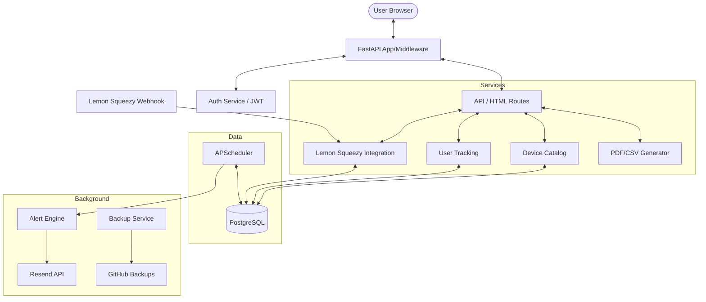

# EOS Tracker: Comprehensive Project Documentation
Version: 1.0.0
Date: 2026-02-01

---

## 1. Project Vision & Core Concept

### 1.1 The Problem
Enterprise network infrastructure (Cisco routers, Juniper switches, Palo Alto firewalls) follows a strict lifecycle. Manufacturers release hardware, then announce **End of Sale (EoS)**, followed by **End of Support (EoS)** or **End of Life (EoL)**. Missing these dates leads to:
- **Security Risks**: No more security patches for critical vulnerabilities.
- **Operational Risks**: Hardware failure without manufacturer support means downtime.
- **Compliance Issues**: Regulated industries (PCI-DSS, HIPAA) require supported hardware.

### 1.2 The Solution: EOS Tracker
EOS Tracker is a centralized, automated platform designed for network engineers and IT managers. It eliminates the need for manual spreadsheets by providing:
- A curated catalog of networking devices with accurate lifecycle dates.
- An automated alerting system (Email-based) that notifies users 365, 180, 90, and 30 days before support ends.
- Multi-format reporting (PDF, CSV, Excel) for inventory management.
- A tiered subscription model (Free/Pro) to scale with business needs.

---

## 2. Technical Architecture

### 2.1 Technology Stack
- **Backend Framework**: [FastAPI](https://fastapi.tiangolo.com/) (Asynchronous, Type-hinted)
- **Database**: [PostgreSQL](https://www.postgresql.org/) (Relational storage)
- **ORM**: [SQLAlchemy 2.0](https://www.sqlalchemy.org/)
- **Frontend**: HTML5, Vanilla CSS (Terminal-inspired design), [Jinja2 Templates](https://jinja.palletsprojects.com/)
- **Task Scheduling**: [APScheduler](https://apscheduler.readthedocs.io/) (PostgreSQL-backed job store)
- **Authentication**: JWT (JSON Web Tokens) with dual Cookie/Header support
- **Infrastructure**: [Docker](https://www.docker.com/) & [Docker Compose](https://docs.docker.com/compose/)
- **External Integrations**:
  - **Lemon Squeezy**: Payments & Subscription management
  - **Resend**: Transactional & Alert emails
  - **GitHub API**: Automated offsite database backups

### 2.2 System Architecture Diagram


---

## 3. Detailed Component Analysis

### 3.1 Database Layer (`database/`)
The database uses a clean normalized structure to handle thousands of devices and users.

#### [models.py](file:///c:/Users/HP/Downloads/eostracker/database/models.py) - Data Schema
- **User**: Stores profile, hashed password, and current `UserTier` (Free/Pro).
- **Device**: The master catalog. Fields include `vendor`, `model`, `device_type`, `eos_date`, `eol_date`, and a unique `slug` for SEO.
- **TrackedDevice**: A join table mapping Users to Devices. Includes `custom_name` (e.g., "Main Core Switch") and `notes`.
- **Subscription**: Linked to Lemon Squeezy. Tracks `status` (active/cancelled), `current_period_end`, and external IDs.
- **AlertHistory**: Tracks every email sent to prevent duplicate alerts.

#### [validators.py](file:///c:/Users/HP/Downloads/eostracker/database/validators.py) - Data Integrity
Custom validation logic for the device catalog:
- Ensures `eos_date` is in `YYYY-MM-DD` format.
- Validates that `eol_date` (if present) is always after `eos_date`.
- Enforces uniqueness on vendor/model combinations via slug validation.

#### [device_cli.py](file:///c:/Users/HP/Downloads/eostracker/database/device_cli.py) - Catalog Management
A powerful CLI tool for maintainers to:
- `update`: Sync JSON data files with the DB (supports `--dry-run`).
- `validate`: Pre-check JSON files before import.
- `export`: Dump the current catalog to JSON.
- `stats`: View vendor distribution and date metrics.

---

### 3.2 Alert & Notification System (`alerts/`)
The "Heart" of the application. It ensures users never miss a date.

#### [service.py](file:///c:/Users/HP/Downloads/eostracker/alerts/service.py) - The Alert Engine
- **Daily Check**: Iterates through all users. Calculates `days_until_eos` for every tracked device.
- **Threshold Matching**: Matches against 365, 180, 90, and 30-day milestones.
- **Immediate Alerts**: Includes logic for "Debounced Immediate Checks." When a user adds a device that is *already* critical (<90 days), an alert is scheduled for 10 minutes later (to group multiple additions).

#### [scheduler.py](file:///c:/Users/HP/Downloads/eostracker/alerts/scheduler.py) - Reliability
- Uses `SQLAlchemyJobStore` to persist jobs in PostgreSQL. If the server restarts, pending alerts are not lost.
- Runs the main check daily (default 9 AM UTC).
- Configurable via `SCHEDULER_HOUR` and `SCHEDULER_MINUTE`.

---

### 3.3 Subscription & Monetization (`subscription/`)
Seamlessly integrates with Lemon Squeezy for a "Set and Forget" experience.

#### [lemonsqueezy.py](file:///c:/Users/HP/Downloads/eostracker/subscription/lemonsqueezy.py) - API Wrapper
- Handles secure checkout creation.
- Manages subscription cancellation API calls.
- Maps Lemon Squeezy Product/Variant IDs to the local environment.

#### [webhooks.py](file:///c:/Users/HP/Downloads/eostracker/subscription/webhooks.py) - Lifecycle Events
- **Security**: Validates every request using `HMAC SHA-256` signature verification.
- **Events**:
  - `subscription_created`: Atomically upgrades user to **PRO** tier.
  - `subscription_updated`: Handles renewals and status changes.
  - `subscription_payment_success`: Updates the `current_period_end` date.
  - `subscription_cancelled / expired`: Gracefully downgrades user to **FREE** tier.

---

### 3.4 Web & API Layer (`web/routes/`)
A dual-purpose interface providing both a "Terminal" UI and a JSON API.

#### [public.py](file:///c:/Users/HP/Downloads/eostracker/web/routes/public.py) - SEO & Discovery
- **Homepage**: Displays featured devices and high-level stats.
- **Search**: Advanced filtering by vendor and device type.
- **Device Pages**: Uses [Structured Data (JSON-LD)](https://schema.org/Product) to ensure search engines index device dates correctly.

#### [api.py](file:///c:/Users/HP/Downloads/eostracker/web/routes/api.py) - Functional Endpoints
- Handles device tracking (Add/Remove).
- **Import/Export**: Supports CSV and Excel via [Pandas](https://pandas.pydata.org/). (Pro feature).
- **Report Generation**: Manages PDF/CSV generation requests.

---

## 4. Infrastructure & Operations

### 4.1 Containerization ([docker-compose.yml](file:///c:/Users/HP/Downloads/eostracker/docker-compose.yml))
The system is divided into three primary services:
1.  **web**: The FastAPI application.
2.  **db**: PostgreSQL 16 instance with persistent volumes.
3.  **db-backup**: A specialized service that:
    - Performs daily `pg_dump`.
    - Compresses backups.
    - Uses Git to push backups to a private **GitHub Repository** for offsite redundancy.

### 4.2 Logging Configuration ([logging_config.py](file:///c:/Users/HP/Downloads/eostracker/logging_config.py))
- **Structured Logging**: Outputs logs in JSON format for easy parsing by ELK/Loki.
- **Filter logic**: Redirects errors (ERROR+) to `stderr` and general info to `stdout`.
- **Middleware**: Automatically logs request method, path, status, and duration (ms) without leaking PII (Personal Identifiable Information).

---

## 5. Security Model

### 5.1 Authentication ([auth/](file:///c:/Users/HP/Downloads/eostracker/auth/))
- **JWT-Based**: Tokens are signed with `HS256`.
- **Dual-Mode**: The application accepts tokens from both `Authorization: Bearer` headers (for API) and `access_token` cookies (for the Web UI).
- **Password Safety**: Uses `bcrypt` with a cost factor of 12 for hashing.

### 5.2 Admin Interface ([admin/](file:///c:/Users/HP/Downloads/eostracker/admin/))
- Powered by `SQLAdmin`.
- **Custom Auth**: A separate `AdminAuth` backend ensures only users with the `is_admin` flag can access the dashboard.
- **ModelViews**: Customized interfaces for Users, Subscriptions, and Audit Logs (Alert History).

---

## 6. Features & Tier Limits

| Feature | Free Tier | Pro Tier |
| :--- | :--- | :--- |
| **Device Tracking** | Max 3 Devices | Unlimited |
| **Email Alerts** | Yes | Yes |
| **PDF Reports** | Basic Table | Enhanced (with Charts) |
| **CSV/Excel Export** | No | Yes |
| **CSV/Excel Import** | No | Yes |
| **Pricing** | $0/mo | $49/mo |

---

## 7. Operational Guides

### 7.1 Seeding the Database
To populate the database with initial device data (~100 devices):
```powershell
docker-compose exec web python -c "from database.seed_data import seed_devices; seed_devices()"
```

### 7.2 Manual Backup Trigger
To force an immediate backup to GitHub:
```powershell
docker-compose exec db-backup /scripts/backup_and_sync.sh
```

### 7.3 Running Tests
Comprehensive tests with coverage report:
```powershell
pytest --cov=. --cov-report=term-missing
```

---
*End of Documentation - Generated by Antigravity*
